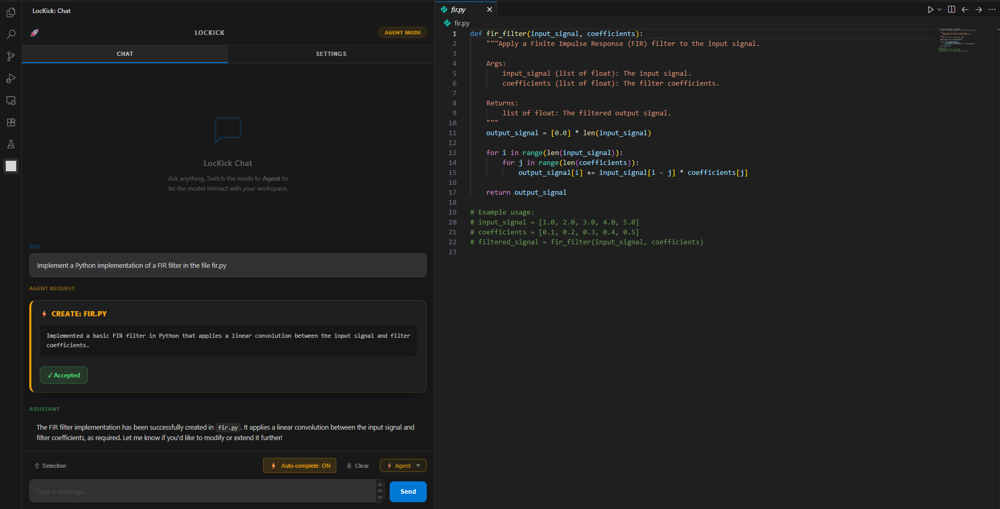
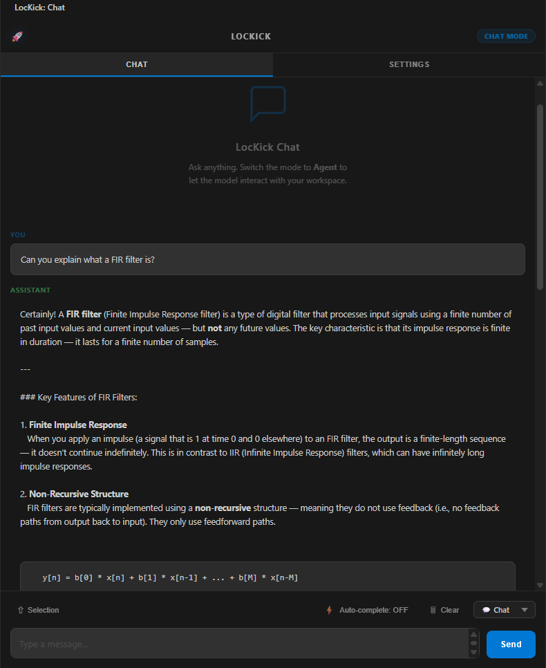
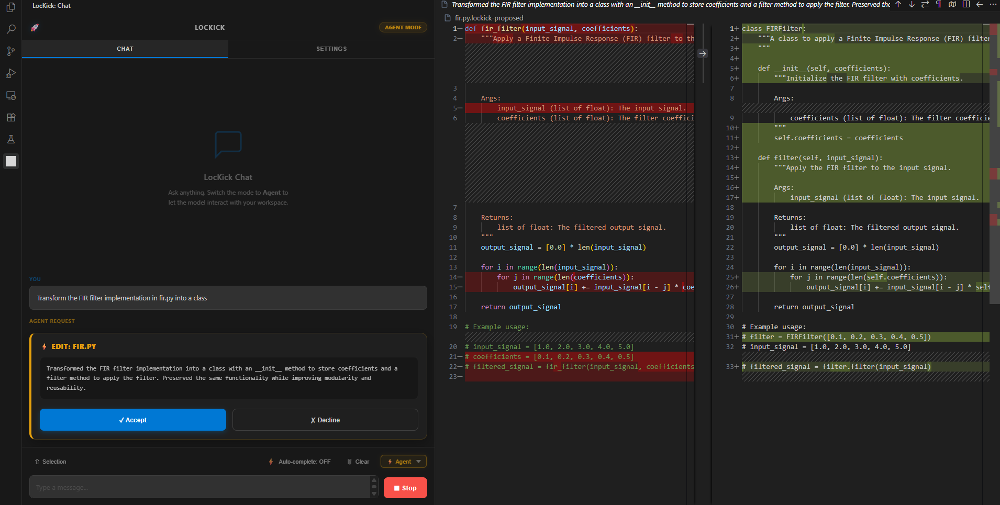
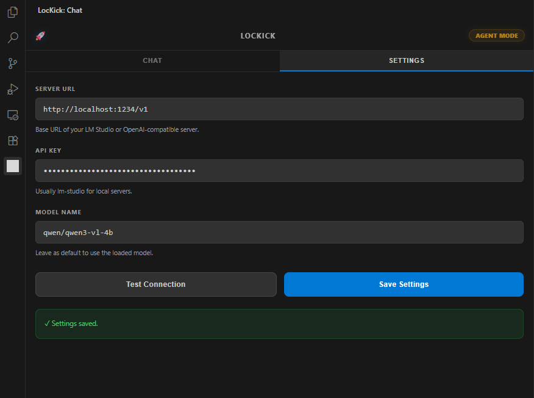

# LocKick

A lightweight, fully-local AI coding assistant designed specifically for Visual Studio Code.

LocKick integrates conversational AI, intelligent code generation, and an autonomous coding agent directly into your editor. It is built and optimized to connect to small local models (e.g. Qwen 3 or Gemma 3) via external runners (such as LM Studio, Ollama, or any OpenAI-compatible API) without transmitting your code externally.



## Motivation

The primary motivation behind LocKick is to provide a local-first alternative to existing proprietary AI tooling. While advanced extensions like VS Code Copilot are highly capable, they heavily inject large amounts of metadata, hidden workspace context, and complex system prompts into every request. This is especially problematic when running local AI (especially smaller models in the 1B - 8B parameter range), as this excessive metadata consumes valuable context window space and often overwhelms the model and the hardware it is running on, leading in a worst case to degraded, confusing, or hallucinated output in a best case just to a painfully slow coding experience. LocKick is designed to be intentionally minimal. It sends exactly what is necessary—and nothing more—ensuring small, locally-hosted models remain fast, focused, and accurate.

---

## User Guide

LocKick is designed as a privacy-respecting coding assistant that relies entirely on your own hardware or designated local endpoints.

### Key Features

*   **Native Chat Mode**: A clean, minimalistic chat interface in your sidebar. You can interact via natural language or use the "Selection" command to precisely inject highlighted code into the context without bringing in unrelated files.
    <br>
*   **Agent Mode**: A tool-augmented operational mode where the AI can read workspace files and propose code edits. To ensure security and user control, proposed changes open in a native VS Code Diff view, requiring explicit approval before saving, deleting or creating files.
    <br>
*   **Inline Auto-complete**: Real-time code suggestions rendered inline as you type. This feature can be toggled directly from the chat toolbar to conserve local resources when not needed.

*   **Minimal Configuration/Secure Secrets**: Configure the local server URL, model name, and API key effortlessly via the built-in UI. General settings are saved natively to your VS Code `settings.json`, while your **API key is securely encrypted** using VS Code's SecretStorage API (backed by Windows Credential Manager, macOS Keychain, or Linux libsecret), keeping your sensitive credentials absolutely secure from accidental leaks or syncs.
*   **Window Position**: As any other VSCode extension, the LocKick panel open on the left side by standard. To move it to the right side, right click on the LocKick title bar and select "Move primary side bar right".

### Getting Started

1.  **Install the Extension**: Install the .vsix provided in the Release section of this repository.
2.  **Start Your Local Server**: Launch your preferred local AI runner (such as LM Studio, Ollama, or a similar OpenAI-compatible backend) and load a model.
3.  **Configure LocKick**:
    *   Open the LocKick panel in VS Code.
    *   Navigate to the **Settings** tab.
    *   Enter your server URL (e.g., `http://localhost:1234/v1`).
    *   Click **Test Connection** to verify connectivity with your active model.



---

## Developer Guide & Contributing

LocKick is built to be easily extensible. If you are interested in contributing, this section outlines the project structure and how to get started.

### Architecture Overview

The extension is written in TypeScript and follows a strict separation of concerns:

*   **`src/extension.ts`**: The main entry point. It registers commands, webview providers, and the inline completion provider.
*   **`src/providers/`**: Contains the UI and interaction logic.
    *   `chatViewProvider.ts`: Manages the webview UI (HTML, CSS, JS) and message routing.
    *   `inlineCompletionProvider.ts`: Interfaces with the standard VS Code Inline Completion API.
    *   `agentLogProvider.ts`: Supplies formatting and display logic for agent tool calls and reasoning logs.
*   **`src/agent/`**: Contains the core logic for the autonomous agent mode (`agentRunner.ts`) and the implementations of specific workspace manipulation tools (`agentTools.ts`).
*   **`src/utils/openaiClient.ts`**: A minimal, dependency-free wrapper for interacting with OpenAI-compatible endpoints using native `fetch`.

### Setting Up the Environment

1.  Clone the repository:
    ```bash
    git clone https://github.com/MaxQ22/LockKick.git
    cd LockKick
    ```
2.  Install dependencies:
    ```bash
    npm install
    ```
3.  Launch the debugger: Press `F5` in VS Code. This will compile the TypeScript code and open an "Extension Development Host" window with the extension loaded.
4.  For continuous background compilation during development, run `npm run watch` in your terminal.

### Packaging the Extension

When you are ready to distribute or manually install the extension, you package it into a `.vsix` file using VS Code's extension management CLI (`vsce`).

1. Verify the `version` number in `package.json` is correct for your release.
2. Run the packaging command in the root directory:
   ```bash
   npx @vscode/vsce package --no-yarn
   ```
3. A `lockick-x.x.x.vsix` file will be generated in your workspace. You and other users can easily install this package directly from the "Extensions" view in VS Code by selecting "Install from VSIX...".

## License

This software is released under the **GNU General Public License v3.0 (GPL-3.0)**. 

Please see the [LICENSE](LICENSE) file located in the root directory for the complete legal text. You are free to redistribute and/or modify this project under the terms provided by the Free Software Foundation.
